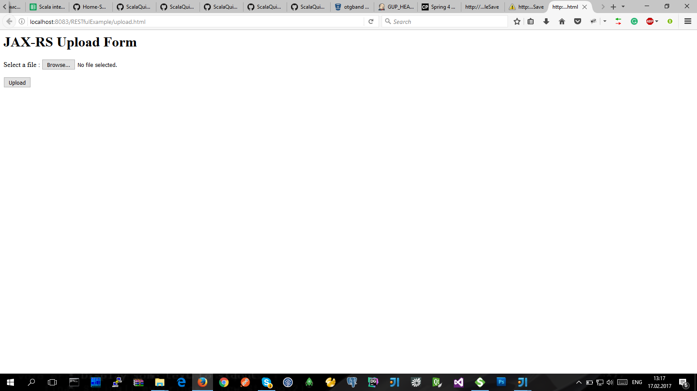
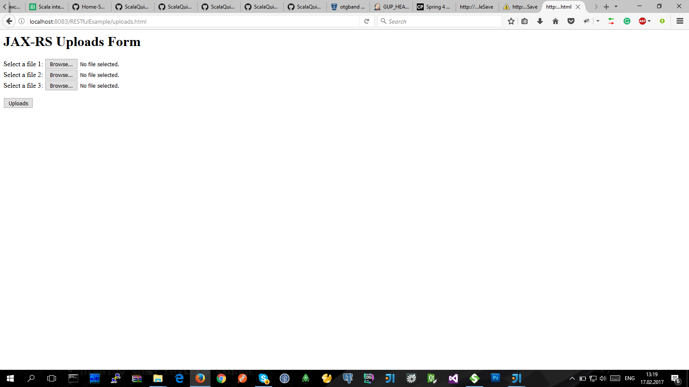
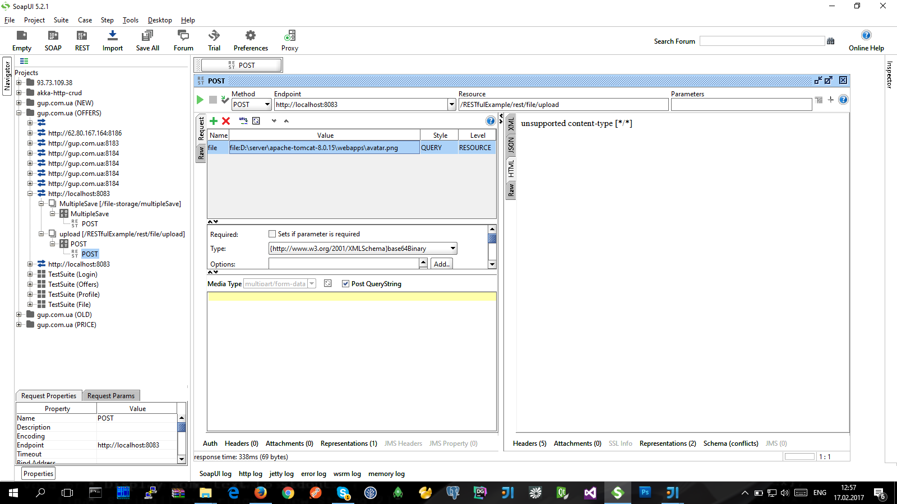

[File upload example in RESTEasy](https://www.mkyong.com/webservices/jax-rs/file-upload-example-in-resteasy/)
--------------------------------

> Реализация загрузки файла с помощью библиотеки **RESTEasy** :

- [mkyong.com/webservices/jax-rs/file-upload-example-in-resteasy](https://www.mkyong.com/webservices/jax-rs/file-upload-example-in-resteasy/)
- JDK-1.6
- Maven-2.x
- Tomcat-1.7

- билд: **RESTfulExample** **(** RESTfulExample.war **)**
- HTML-форма: http://localhost:8083/RESTfulExample/upload.html   http://localhost:8083/RESTfulExample/uploads.html
- REST (url): POST   http://localhost:8083/RESTfulExample/rest/file/upload   file=file:D:\server\apache-tomcat-8.0.15\webapps\avatar.png
- путь загрузки файла в: D:\server\apache-tomcat-7.0.70\photos

